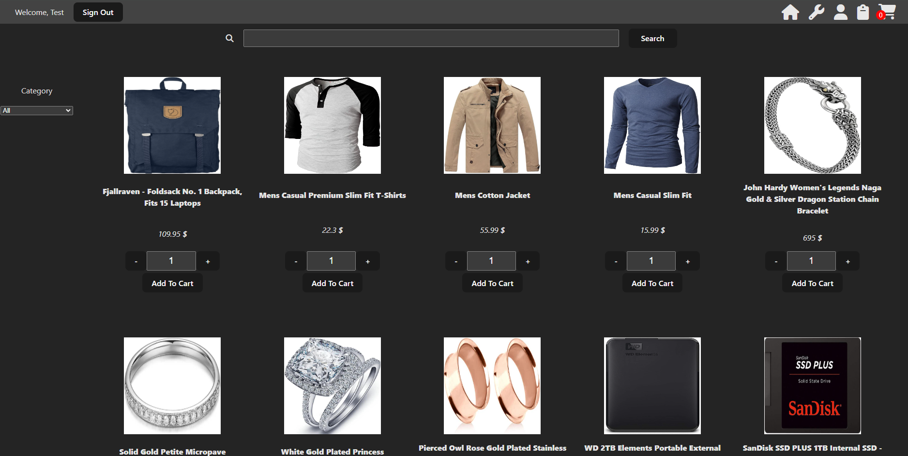
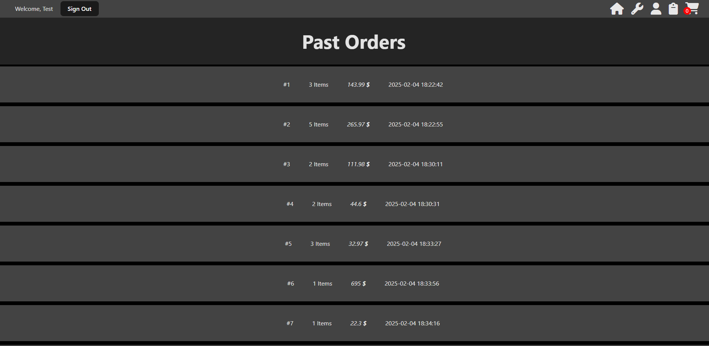
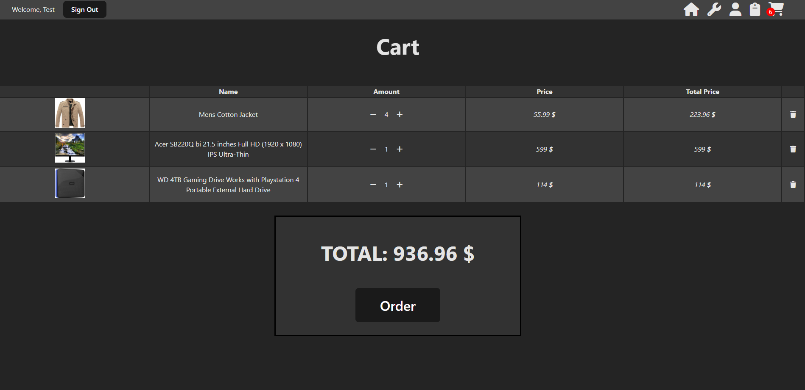

# Webshop (WIP)

A Webshop application built with **Node.js**, **Vite** and **React**. This is a mockup for an online shop that allows the user to add items to their cart and create orders.

## Features
- **User Account**: Account creation and login.
- **Session Persistence**: Uses JSON Web Tokens to keeps users logged in.
- **Shopping Cart**: Users can add and remove products to/from the cart.
- **Orders**: Users can create an order with the items inside of the cart.
- **Order History**: View all previous orders and download individual orders as PDF.
- **Responsive Design**: Adapts to various screen sizes. **(WIP)**

## Tech Stack
- **Frontend**: React, Vite, CSS, JavaScript
- **Backend**: NodeJS, Express
- **API**: FakeStore API
- **Database**: SQLite
- **Version Control**: Git, GitHub

## Screenshots







## Setup and Installation

### Prerequisites
- **Node.js**
- **npm**

### 1. Clone the Repository
```bash
git clone https://github.com/BerinMadzak/Webshop.git
cd Webshop
```

### 2. Install Dependencies
```bash
# Client dependencies
cd client
npm install

# Go back to root
cd ..

# Server dependencies
cd server
npm install
```
### 3. Set up Environmental Variables
Create a `.env` file at the root of `server` and add the following keys: 
```bash
FRONTEND="http://localhost:5173" # IP for the client
SECRET_KEY="TEMP KEY" # Used for password hashing
```

### 4. Run the server
```bash
# From root 
cd server
npm run dev
```

### 5. Run the client
```bash
# From root
cd client
npm run dev
```

### 6. Reset database (optional)
```bash
# From root
node .\server\data\init-db.js
```

### 7. Admin account 
You can log in as admin with these credentials:
```bash
username=admin
password=123456
```